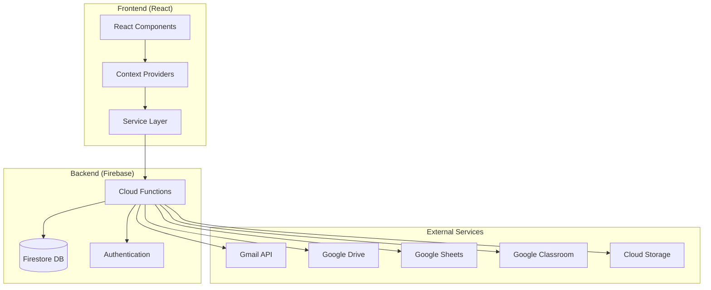

# Ready-Teacher: A Comprehensive Classroom Management Platform

> **Dynamic Content Notice**: This page content is managed by administrators and can be updated through the admin panel. All sections marked with 🔧 are editable by admins.

---

## 🌟 Developer & Creator Profile

### About the Creator 🔧
**Name:** [ADMIN_EDITABLE: Developer Name]  
**Role:** Educator & Full-Stack Developer  
**Teaching Experience:** [ADMIN_EDITABLE: Years of teaching experience]  
**Specialization:** [ADMIN_EDITABLE: Teaching subjects/grade levels]  
**Current School:** [ADMIN_EDITABLE: Current teaching position/school]  
**Educational Background:** [ADMIN_EDITABLE: Teaching credentials and technical education]  

### The Teacher-Developer Journey 🔧

**Why I Built Ready-Teacher:** 🔧
[ADMIN_EDITABLE: Personal story about the frustrations and challenges you faced as a teacher that motivated you to create this solution]

**From Classroom Pain Points to Code Solutions:** 🔧
[ADMIN_EDITABLE: Specific examples of daily teaching struggles that each feature addresses - like spending hours on parent emails, managing paper gradebooks, tracking behavior incidents manually, etc.]

**Teaching Philosophy & Technology Integration:** 🔧
[ADMIN_EDITABLE: How your teaching philosophy influenced the app's design - student-centered approach, data-driven decisions, family communication, etc.]

### Professional Background 🔧

**Teaching Credentials:** 🔧
- [ADMIN_EDITABLE: Teaching license/certifications]
- [ADMIN_EDITABLE: Specialized training or endorsements]
- [ADMIN_EDITABLE: Professional development highlights]

**Technical Skills:** 🔧
- [ADMIN_EDITABLE: Programming languages and frameworks]
- [ADMIN_EDITABLE: Educational technology certifications]
- [ADMIN_EDITABLE: Cloud platforms and tools]

**Contact Information:** 🔧
- **Email:** [ADMIN_EDITABLE: contact@email.com]
- **LinkedIn:** [ADMIN_EDITABLE: LinkedIn profile URL]
- **GitHub:** [ADMIN_EDITABLE: GitHub profile URL]
- **Teaching Portfolio:** [ADMIN_EDITABLE: Portfolio/website URL]
- **Speaking/Consulting:** [ADMIN_EDITABLE: Professional services contact]

---

## 🚀 Application Overview

### What is Ready-Teacher?

Ready-Teacher is a comprehensive web-based classroom management platform designed by an educator, for educators. Born from real classroom challenges, this application streamlines the daily workflows that consume teachers' valuable time.

### 🎯 Core Problems Solved (From a Teacher's Perspective)

✅ **Manual Grading Nightmares** - No more spreadsheet headaches! Automated calculations with standards-based proficiency scales  
✅ **Parent Communication Chaos** - From 2+ hours of daily emails to 10 minutes with Gmail API automation  
✅ **Behavior Documentation Burden** - Skills-based tracking that actually helps kids grow, not just punish  
✅ **Reporting Time Drain** - What used to take 3 hours now takes 15 minutes with automated updates  
✅ **Lesson Planning Disconnection** - Standards, assignments, and assessments finally talk to each other  
✅ **Language Barrier Frustration** - English/Arabic support for diverse classroom communities  
✅ **Data Silos** - One platform instead of juggling 6 different tools  
✅ **Offline Access Anxiety** - Works without internet because teachers can't always rely on school WiFi

### 💡 The "Aha!" Moment 🔧
[ADMIN_EDITABLE: The specific moment or incident that made you realize you needed to build this solution - perhaps a late night grading session, a parent conference, or struggling with data entry]  

---

## 🛠️ Technical Architecture (Built by a Teacher for Teachers)

### Why These Technology Choices Matter in Education

As a teacher-developer, every technology choice was made with classroom realities in mind:

**Frontend (Designed for Busy Teachers):**
- ⚛️ **React 18.2.0** - Fast, responsive UI that works on teacher laptops AND parent phones
- 🎨 **Material-UI 5.14+** - Professional look that parents trust, accessible for all users
- 🌐 **React Router 6.22** - Quick navigation during parent conferences
- 🔄 **Context API** - Real-time updates when viewing student data
- 📱 **Progressive Web App** - Install on phone, works offline during field trips

**Backend (Designed for Educational Security):**
- ☁️ **Firebase Cloud Functions** - Scales during report card seasons, secure for student data
- 🔥 **Firestore Database** - Real-time sync across devices, FERPA-compliant
- 🔐 **Firebase Authentication** - Google SSO that schools already use
- 📧 **Gmail API Integration** - Works with teacher's existing email (no new accounts!)
- 💾 **Google Workspace Integration** - Fits into school's existing ecosystem

**Educational-Specific Features:**
- 🌍 **Multi-language Support (i18next)** - Essential for diverse communities
- 📊 **Real-time Analytics** - Data that helps teachers make instructional decisions
- 🎯 **Standards-Based Grading** - Aligns with modern educational best practices
- 📱 **Mobile-Responsive** - Parents check updates on phones, teachers work on tablets
- 🔒 **COPPA/FERPA Considerations** - Built with student privacy laws in mind

**Google Workspace Integration:**
- 📧 **Gmail API** - Automated parent communication from teacher's own email
- 💾 **Google Drive API** - Document sharing and attachment management
- 📊 **Google Sheets** - Grade export and data import capabilities
- 🏫 **Google Classroom** - Assignment sync and student roster management
- ☁️ **Google Cloud Storage** - Secure file storage and backup

### Architecture Diagram



---

## 🚀 Feature Status Dashboard (Admin Controlled) 🔧

> **Note**: Administrators can update the status of each feature to reflect current development progress, upcoming releases, or deprecated functionality.

### 👍 **Core Features (Shipped)**

**Gradebook & Assessment** 🔧
- Status: [ADMIN_EDITABLE: ✅ Shipped | 🚧 In Progress | 🕰️ Coming Soon | ❌ Deprecated]
- Standards-based grading with 1-4 proficiency scales
- Category weighting and automatic calculations
- Assignment templates and rubric integration
- Real-time grade tracking and parent notifications
- Export to Google Sheets and PDF reports

**Student Behavior Tracking** 🔧
- Status: [ADMIN_EDITABLE: ✅ Shipped | 🚧 In Progress | 🕰️ Coming Soon | ❌ Deprecated]
- Skills-based behavior framework (Resilience, Self-Regulation, etc.)
- Growth dashboard with trend analysis
- Reflection conference tools for student meetings
- Restorative action tracking and intervention suggestions
- Parent communication integration with positive highlights

**Automated Communication** 🔧
- Status: [ADMIN_EDITABLE: ✅ Shipped | 🚧 In Progress | 🕰️ Coming Soon | ❌ Deprecated]
- Gmail API integration for seamless email sending
- Personalized daily/weekly/monthly student updates
- Multi-language email templates (English/Arabic)
- Scheduled reporting and emergency notifications
- Dynamic content system with admin-editable templates

### 🔧 **Google Workspace Integration**

**Gmail Integration** 🔧
- Status: [ADMIN_EDITABLE: ✅ Shipped | 🚧 In Progress | 🕰️ Coming Soon | ❌ Deprecated]
- OAuth2 authentication for secure email sending
- Send from teacher's own email address
- Automated daily update generation and delivery
- Email template customization and personalization
- Rate limiting and quota management

**Google Drive Integration** 🔧
- Status: [ADMIN_EDITABLE: ✅ Shipped | 🚧 In Progress | 🕰️ Coming Soon | ❌ Deprecated]
- File picker for lesson materials and attachments
- Document sharing with students and parents
- Automatic backup of important classroom documents
- Integration with assignment submission workflows
- Bulk file operations and organization tools

**Google Sheets Integration** 🔧
- Status: [ADMIN_EDITABLE: ✅ Shipped | 🚧 In Progress | 🕰️ Coming Soon | ❌ Deprecated]
- Grade export for district reporting requirements
- Attendance data synchronization
- Custom report generation and scheduling
- Data import from existing gradebooks
- Real-time collaborative grade editing

**Google Classroom Integration** 🔧
- Status: [ADMIN_EDITABLE: ✅ Shipped | 🚧 In Progress | 🕰️ Coming Soon | ❌ Deprecated]
- Student roster synchronization
- Assignment creation and distribution
- Grade passback to Classroom gradebook
- Course material sharing and organization
- Parent guardian notifications sync

### 📊 **Analytics & Reporting**

**Student Growth Analytics** 🔧
- Status: [ADMIN_EDITABLE: ✅ Shipped | 🚧 In Progress | 🕰️ Coming Soon | ❌ Deprecated]
- Comprehensive progress dashboards
- Standards mastery tracking over time
- Intervention identification algorithms
- Parent conference preparation reports
- Predictive analytics for student success

**Class Performance Insights** 🔧
- Status: [ADMIN_EDITABLE: ✅ Shipped | 🚧 In Progress | 🕰️ Coming Soon | ❌ Deprecated]
- Real-time class performance metrics
- Assignment difficulty analysis
- Learning objective mastery rates
- Behavior trend analysis across students
- Curriculum effectiveness measurement

### 📱 **Mobile & Accessibility**

**Progressive Web App** 🔧
- Status: [ADMIN_EDITABLE: ✅ Shipped | 🚧 In Progress | 🕰️ Coming Soon | ❌ Deprecated]
- Installable on mobile devices
- Offline functionality for core features
- Push notifications for important updates
- Touch-optimized interface design
- Fast loading and responsive performance

**Accessibility Features** 🔧
- Status: [ADMIN_EDITABLE: ✅ Shipped | 🚧 In Progress | 🕰️ Coming Soon | ❌ Deprecated]
- WCAG 2.1 AA compliance
- Screen reader compatibility
- High contrast mode support
- Keyboard navigation optimization
- Multi-language interface support

### 🚀 **Advanced Features**

**AI-Powered Insights** 🔧
- Status: [ADMIN_EDITABLE: ✅ Shipped | 🚧 In Progress | 🕰️ Coming Soon | ❌ Deprecated]
- Automated grade trend analysis
- Personalized intervention recommendations
- Behavior pattern recognition
- Parent communication suggestions
- Assignment difficulty optimization

**Advanced Scheduling** 🔧
- Status: [ADMIN_EDITABLE: ✅ Shipped | 🚧 In Progress | 🕰️ Coming Soon | ❌ Deprecated]
- Automated parent conference scheduling
- Recurring report generation
- Bulk email scheduling with smart timing
- Academic calendar integration
- Reminder and notification automation

**District-Level Features** 🔧
- Status: [ADMIN_EDITABLE: ✅ Shipped | 🚧 In Progress | 🕰️ Coming Soon | ❌ Deprecated]
- Multi-school data aggregation
- District reporting and compliance tools
- Teacher collaboration platforms
- Administrative oversight dashboards
- Bulk user management and permissions

### 🚫 **Deprecated Features**

**Legacy Gradebook System** 🔧
- Status: [ADMIN_EDITABLE: ✅ Shipped | 🚧 In Progress | 🕰️ Coming Soon | ❌ Deprecated]
- Replaced by standards-based grading system
- Data migration tools available
- Support ending: [ADMIN_EDITABLE: Date]
- Migration deadline: [ADMIN_EDITABLE: Date]

### 🕰️ **Release Timeline** 🔧

**Next Quarter (Q[ADMIN_EDITABLE: Quarter] 202[ADMIN_EDITABLE: Year])**
[ADMIN_EDITABLE: List of planned features and expected release dates]

**Next Year (202[ADMIN_EDITABLE: Year])**
[ADMIN_EDITABLE: Long-term roadmap items and major feature releases]

**Feature Request Priorities** 🔧
[ADMIN_EDITABLE: Top community-requested features ranked by priority and development status]

---

## ✨ Feature Showcase (Real Teacher Solutions)

### 📚 Gradebook Management (No More Spreadsheet Hell)
**Before Ready-Teacher:** 3-4 hours weekly wrestling with Excel formulas  
**After Ready-Teacher:** 15 minutes weekly with automated calculations  

- **Standards-based grading** with 1-4 proficiency scales (aligned with district requirements)
- **Category weighting** that actually makes sense to parents
- **Assignment templates** for recurring assessments (exit tickets, labs, projects)
- **Real-time grade tracking** - see immediately when a student needs intervention
- **Parent portal integration** - no more "What's my child's grade?" emails

### 👥 Student Behavior Analytics (Growth, Not Punishment)
**The Teacher Reality:** Behavior tracking that helps kids grow instead of just documenting problems  

- **Skills-based tracking** (Resilience, Self-Regulation, Collaboration) not just "good/bad"
- **Growth dashboard** showing progress over time
- **Reflection conference tools** for meaningful student conversations
- **Restorative action tracking** focusing on learning from mistakes
- **Parent communication integration** with positive behavior highlights
- **Data-driven interventions** based on patterns, not emotions

### 📧 Automated Communication (Sanity-Saving Parent Updates)
**Before:** 2+ hours daily writing individual parent emails  
**After:** 10 minutes daily with smart automation  

- **Daily student updates** via Gmail integration (customizable templates)
- **Personalized email content** with student-specific achievements
- **Automated attendance/assignment notifications**
- **Multi-language support** for diverse families
- **Scheduled reporting** (weekly progress, monthly summaries)
- **Emergency communication** for urgent situations

### 📊 Comprehensive Reporting (Data That Actually Helps)
**Teacher-Designed Analytics:** Reports that inform instruction, not just compliance  

- **Student progress dashboards** with actionable insights
- **Class performance trends** to guide lesson planning
- **Standards mastery tracking** aligned with curriculum maps
- **Intervention identification** based on multiple data points
- **Parent conference preparation** with comprehensive student profiles
- **Exportable reports** for IEP meetings and administrative requirements

---

## 🏗️ System Architecture Details

### Database Collections

The application uses a well-structured Firestore database with the following core collections:

- **`students`** - Student profiles and academic information
- **`assignments`** - Assignment definitions and metadata
- **`grades`** - Student scores and assessments
- **`attendance`** - Daily attendance tracking
- **`behaviors`** - Behavior incidents and skills tracking
- **`gradebooks`** - Gradebook configurations
- **`lessons`** - Lesson plans and curriculum
- **`users`** - Teacher accounts and preferences
- **`emailContent`** - Dynamic email templates (Admin Editable 🔧)
- **`featureStatus`** - Feature availability and status management (Admin Editable 🔧)
- **`releaseNotes`** - Version history and feature announcements (Admin Editable 🔧)

### 💻 Feature Status Management System

**Dynamic Feature Control:**
Administrators can control feature visibility and status through the admin panel:

```javascript
// Example: Feature status document structure
{
  featureId: "google-classroom-integration",
  name: "Google Classroom Integration",
  status: "in_progress", // shipped | in_progress | coming_soon | deprecated
  visibility: "public", // public | beta | internal | hidden
  description: "Assignment sync and roster management",
  eta: "2024-Q2",
  deprecationDate: null,
  migrationInstructions: null,
  adminNotes: "OAuth setup pending district approval"
}
```

**Status Badge System:**
- ✅ **Shipped** - Feature is live and available to all users
- 🚧 **In Progress** - Feature is under active development
- 🕰️ **Coming Soon** - Feature is planned and designed
- ❌ **Deprecated** - Feature will be removed, migration available

### Security & Privacy (Built for Student Safety)

- 🔐 **Firebase Authentication** with Google OAuth2 (schools already trust Google)
- 🛡️ **Firestore Security Rules** protecting sensitive student data
- 🔒 **Encrypted token storage** for Gmail integration (no passwords stored)
- 👨‍💼 **Admin role management** for district oversight
- 📋 **COPPA/FERPA compliance** built into the architecture
- 🔍 **Audit trails** for all data access and modifications
- 🌐 **Data sovereignty** options for international schools

### 💻 Code Architecture Designed for Teachers 🔧

**Why These Technical Decisions Matter:**

[ADMIN_EDITABLE: Explanation of how technical architecture decisions were made with teacher needs in mind - for example, why Firebase was chosen for reliability during parent conference week, why Material-UI ensures accessibility for diverse learners, etc.]

**Feature Development Priorities:**
1. **Reliability First** - Must work during report card crunch time
2. **Intuitive UX** - Teachers don't have time to learn complex interfaces
3. **Mobile-Responsive** - Parent communication happens on phones
4. **Offline Capable** - School WiFi isn't always reliable
5. **Scalable** - From single teacher to entire district

**Teacher-Tested Development Process:** 🔧
[ADMIN_EDITABLE: Your specific development workflow - how you test features during planning periods, get feedback from teacher colleagues, iterate based on real classroom use]

---

## 💡 Innovation Highlights

### 🔧 Admin-Editable Content System
One of the unique features is the comprehensive content management system that allows administrators to:

**Dynamic Content Management:**
- Edit email template content in real-time
- Customize motivational quotes and greetings  
- Modify visual themes and achievement badges
- Update application messaging and help text
- Configure content sharing between teachers

**Feature Status Control:**
- Update feature availability and status badges
- Control which features are visible to users
- Set release timelines and deprecation schedules
- Manage beta feature access and testing groups
- Add admin-only notes for internal tracking

**Release Management:**
- Create and publish release notes
- Schedule feature announcements
- Manage user notifications about updates
- Control feature rollout to different user groups
- Track feature adoption and usage metrics

### 🎨 Email Personalization Engine
The application features a sophisticated email personalization system:

```javascript
// Example: Dynamic email content
{
  "greetings": [
    "Hi {firstName}! Here's your amazing progress today! ✨",
    "Hey {firstName}! Check out what you accomplished! 🚀",
    "Great work today, {firstName}! Here's your summary 📊"
  ],
  "motivationalQuotes": [
    "Every expert was once a beginner! 🌟",
    "Progress, not perfection! 💪",
    "You're doing amazing things! 🎯"
  ]
}
```

### 📱 Progressive Web App Features
- **Offline functionality** for core features
- **Installable** on mobile devices
- **Push notifications** for important updates
- **Responsive design** across all screen sizes

---

## 🎨 The Teacher-Developer Advantage

### 🤝 Why Teacher-Built EdTech is Different

Most educational technology is built by developers who have never managed a classroom. Ready-Teacher is different because it's designed by someone who:

- **Lives the Daily Reality** - Every feature solves a problem I've personally experienced
- **Understands Teacher Workflow** - The interface follows how teachers actually think and work
- **Knows Parent Expectations** - Communication features reflect what families really want to know
- **Respects Student Privacy** - Built with deep understanding of FERPA, COPPA, and ethical data use
- **Values Educational Equity** - Multi-language support and accessibility aren't afterthoughts

### 📚 Real Classroom Testing 🔧
[ADMIN_EDITABLE: Stories about how you tested features in your own classroom, with your own students and parents, including both successes and failures that led to improvements]

### 💬 Teacher Collaboration in Development 🔧
[ADMIN_EDITABLE: How you involved other teachers in the development process - beta testing, feature requests, user feedback sessions]

### 🌎 Educational Philosophy in Code

**Growth-Minded Design:**
- Behavior tracking focuses on skill development, not punishment
- Standards-based grading emphasizes learning progress over point accumulation
- Communication templates encourage positive, solution-focused language

**Equity-Centered Features:**
- Multi-language support for diverse communities
- Offline functionality for areas with limited internet access
- Mobile-responsive design for families without computers
- Admin-editable content to reflect local community values

**Data-Informed Instruction:**
- Analytics that guide teaching decisions, not just compliance reporting
- Real-time insights that help identify students who need support
- Trend analysis that reveals learning patterns over time

### 🎯 Continuous Improvement Through Teaching Practice 🔧
[ADMIN_EDITABLE: How your ongoing teaching experience continues to inform app development - new features inspired by current classroom challenges]

---

## 🎓 Educational Impact & Teacher Success Stories

### 📊 Time-Saving Metrics (Real Data from Real Teachers) 🔧
- **Grading Time Reduction:** [ADMIN_EDITABLE: XX%] faster grade processing
- **Parent Communication:** [ADMIN_EDITABLE: XX hours] saved per week
- **Report Generation:** [ADMIN_EDITABLE: XX%] reduction in administrative time
- **Data Entry:** [ADMIN_EDITABLE: XX%] less manual input required
- **Teacher Satisfaction:** [ADMIN_EDITABLE: XX%] report improved work-life balance

### 🏆 Teacher Testimonials 🔧

**Elementary Teachers:** 🔧
[ADMIN_EDITABLE: Testimonials from elementary teachers about parent communication improvements, behavior tracking for young students, etc.]

**Middle School Teachers:** 🔧
[ADMIN_EDITABLE: Testimonials from middle school teachers about standards-based grading, student self-reflection tools, etc.]

**High School Teachers:** 🔧
[ADMIN_EDITABLE: Testimonials from high school teachers about college readiness tracking, comprehensive portfolio building, etc.]

**Special Education Teachers:** 🔧
[ADMIN_EDITABLE: Testimonials about IEP goal tracking, behavior intervention data, parent collaboration tools]

### 🏢 School District Success Stories 🔧

**Case Study 1: [ADMIN_EDITABLE: District Name]** 🔧
[ADMIN_EDITABLE: Detailed case study about district-wide implementation, challenges overcome, and results achieved]

**Case Study 2: [ADMIN_EDITABLE: School Name]** 🔧
[ADMIN_EDITABLE: Story about individual school transformation, including before/after metrics and teacher feedback]

**Case Study 3: [ADMIN_EDITABLE: Multi-Language Community]** 🔧
[ADMIN_EDITABLE: Success story about serving diverse linguistic communities, parent engagement improvements]

### 📊 Current Usage Statistics 🔧
- **Active Teachers:** [ADMIN_EDITABLE: Number] educators across [ADMIN_EDITABLE: Number] states/countries
- **Students Served:** [ADMIN_EDITABLE: Number] students receiving better communication
- **Automated Emails:** [ADMIN_EDITABLE: Number]+ parent updates sent monthly
- **Time Saved Collectively:** [ADMIN_EDITABLE: Number] hours returned to teachers weekly
- **Languages Supported:** [ADMIN_EDITABLE: Number] languages for family communication

---

## 🚀 Getting Started for Developers

### Prerequisites
```bash
# Required tools
Node.js >= 16
npm >= 8
Firebase CLI
Git
```

### Installation
```bash
# Clone the repository
git clone [ADMIN_EDITABLE: repository URL]
cd ready-teacher

# Install dependencies
npm install
cd functions && npm install

# Configure Firebase
firebase login
firebase use [project-id]

# Start development server
npm start
```

### Development Workflow
1. **Frontend Development**: `npm start` for hot reloading
2. **Backend Testing**: `firebase emulators:start`
3. **Database Management**: Firebase Console
4. **Deployment**: `firebase deploy`

---

## 🤝 Contributing & Collaboration

### Open Source Philosophy 🔧
[ADMIN_EDITABLE: Information about open source contributions, licensing, and community involvement - your vision for how teachers and developers can collaborate to improve educational technology]

### How Teachers Can Contribute 🔧

**Feature Requests from the Classroom:**
[ADMIN_EDITABLE: Guidelines for educators who want to contribute features, feedback, or testing - perhaps a form or process for teachers to submit ideas based on their classroom needs]

**Beta Testing Program:**
[ADMIN_EDITABLE: Information about how teachers can join beta testing of new features, with protections for student data during testing]

**Teacher Advisory Board:**
[ADMIN_EDITABLE: Details about ongoing teacher involvement in product development decisions]

### Developer Guidelines (Maintaining Teacher-Centricity)

**Code Standards with Educational Purpose:**
- Follow React best practices and hooks patterns
- Use Material-UI components for accessibility compliance
- Implement responsive design (teachers work on various devices)
- Write clean, documented code (other teachers might contribute)
- Test across browsers and devices (schools have varying tech)
- **Most Important:** Always consider the teacher user experience

**Educational Context Requirements:**
- Understand FERPA/COPPA implications of any data handling
- Consider diverse learning communities in feature design
- Prioritize reliability during high-stress education periods
- Design for interrupted workflows (teaching is unpredictable)
- Include offline considerations for areas with poor connectivity

### Vision for Teacher-Led EdTech 🔧
[ADMIN_EDITABLE: Your broader vision for how teacher-developers can transform educational technology, perhaps including goals for inspiring other educators to learn to code, creating a community of teacher-developers, etc.]

---

## 📈 Roadmap & Future Features

### Upcoming Features 🔧
[ADMIN_EDITABLE: List of planned features and enhancements]

### Technology Upgrades 🔧
[ADMIN_EDITABLE: Planned technology stack updates and improvements]

### Community Requested Features 🔧
[ADMIN_EDITABLE: Features requested by the teacher community]

---

## 🏆 Recognition & Awards 🔧

[ADMIN_EDITABLE: Any awards, recognition, or notable achievements]

---

## 📞 Support & Community

### Documentation
- **API Reference**: [ADMIN_EDITABLE: Documentation URL]
- **User Guide**: [ADMIN_EDITABLE: User guide URL]
- **Video Tutorials**: [ADMIN_EDITABLE: Tutorial playlist URL]

### Community Channels 🔧
- **Discord Server**: [ADMIN_EDITABLE: Discord invite URL]
- **Teacher Facebook Group**: [ADMIN_EDITABLE: Facebook group URL]
- **Developer Forum**: [ADMIN_EDITABLE: Forum URL]

### Professional Services 🔧
[ADMIN_EDITABLE: Information about professional development, training, or consulting services]

---

## 📄 Legal & Licensing

### License Information 🔧
[ADMIN_EDITABLE: Licensing information and terms]

### Privacy Policy 🔧
[ADMIN_EDITABLE: Link to privacy policy and data handling information]

### Terms of Service 🔧
[ADMIN_EDITABLE: Link to terms of service]

---

## 🎯 Call to Action

### For Educators
Ready to transform your classroom management? [Get started today!]([ADMIN_EDITABLE: Sign-up URL])

### For Developers
Interested in contributing to education technology? [Join our developer community!]([ADMIN_EDITABLE: Developer community URL])

### For Schools & Districts
Looking for enterprise solutions? [Contact us for institutional licensing]([ADMIN_EDITABLE: Contact URL])

---

*Last updated: [ADMIN_EDITABLE: Date] | Built with ❤️ by educators, for educators*

---

## 🔧 Admin Content Management

> **Note for Admins**: All sections marked with 🔧 above can be edited through the admin panel. Use the content management system to update:

### Content Management
- Personal information and developer story
- Statistics and metrics
- Testimonials and case studies
- Roadmap and feature announcements
- Community links and resources
- Legal and licensing information

### Feature Status Management
- Update feature status badges (✅ Shipped, 🚧 In Progress, 🕰️ Coming Soon, ❌ Deprecated)
- Control feature visibility and availability
- Set release timelines and deprecation schedules
- Manage beta feature access for testing groups
- Add internal admin notes for feature tracking
- Create release announcements and user notifications

### Access Instructions
**Admin Panel Access**: Navigate to `/admin` and use the following sections:
- **"Developer Page Content"** - Edit all text content and links
- **"Feature Status Manager"** - Control feature availability and status
- **"Release Management"** - Manage announcements and rollouts
- **"User Communications"** - Update email templates and notifications

### Feature Status Update Process
1. Navigate to Admin Panel > Feature Status Manager
2. Select the feature to update
3. Choose new status: Shipped | In Progress | Coming Soon | Deprecated
4. Update description, timeline, and admin notes
5. Set visibility: Public | Beta | Internal | Hidden
6. Save changes (updates reflect immediately on developer page)

### Content Update Best Practices
- Keep feature statuses current and accurate
- Provide clear ETAs for "Coming Soon" features
- Include migration instructions for deprecated features
- Update testimonials and metrics regularly
- Maintain consistency in messaging across all content