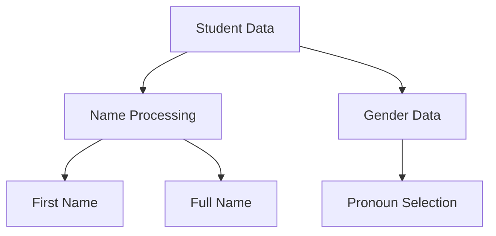
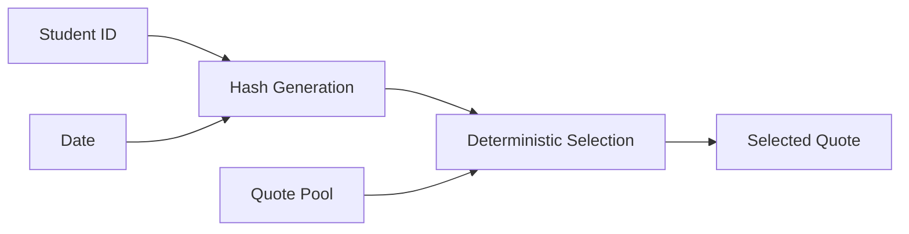
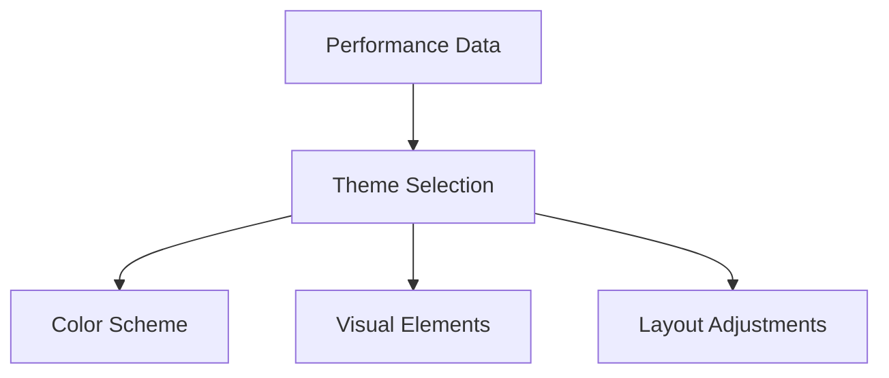
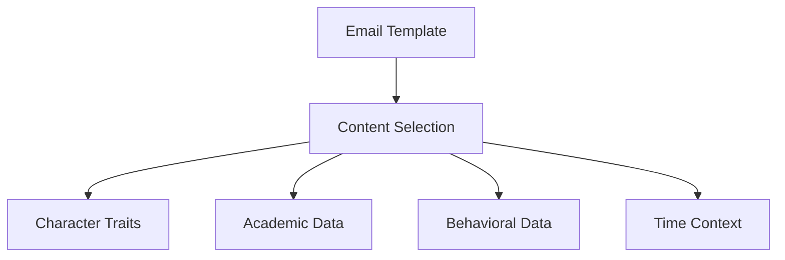

# Current Email Personalization Features Analysis

## Overview
This document analyzes the existing personalization features in the email system, identifying current capabilities, implementation patterns, and areas for enhancement.

## 1. Core Personalization Features

### 1.1 Student Identity Personalization


**Current Implementation:**
- First name extraction from full name
- Gender-aware pronouns (when available)
- Fallback handling for missing data
- Safe HTML encoding of personal data

**Code Location:** `normalizeContext()` in studentDailyUpdateEmail.js

### 1.2 Academic Performance Personalization

**Grade-Based Features:**
- Dynamic color coding based on grade percentages
- Progress meter visualization
- Achievement badges
- Subject-specific focus tips
- Performance-based encouragement messages

**Implementation Details:**
```javascript
const gradeRanges = {
  excellent: { threshold: 90, color: "#2e7d32" },
  good: { threshold: 80, color: "#1976d2" },
  fair: { threshold: 70, color: "#f57c00" },
  needsWork: { threshold: 0, color: "#d32f2f" }
};
```

### 1.3 Behavioral Recognition

**Current Features:**
- Positive behavior highlighting
- Achievement acknowledgment
- Attendance recognition
- Dynamic emoji selection
- Contextual encouragement

## 2. Content Generation Systems

### 2.1 Quote Generation


**Features:**
- Day-specific quotes
- Student-specific selection
- Weekday/weekend variation
- Trait-based selection (when available)

### 2.2 Challenge System

**Current Implementation:**
- Daily unique challenges
- Subject-specific variations
- Character trait integration
- Progressive difficulty

## 3. Visual Personalization

### 3.1 Theme System


**Components:**
- Grade-based color schemes
- Achievement-based badges
- Progress visualizations
- Responsive design elements

### 3.2 Layout Personalization
- Section visibility based on content
- Dynamic content ordering
- Responsive to data availability
- Achievement showcase positioning

## 4. Temporal Personalization

### 4.1 Time-Based Features
- Day-specific greetings
- Weekend vs weekday content
- Due date proximity alerts
- Progress timeline visualization

### 4.2 Academic Period Recognition
- Term/semester awareness
- Assignment due date context
- Grade period summaries
- Attendance period tracking

## 5. Current Limitations

### 5.1 Content Variability
- Limited quote pool
- Fixed challenge templates
- Static encouragement messages
- Predetermined color schemes

### 5.2 Personalization Depth
- Basic gender recognition
- Limited learning style adaptation
- Fixed engagement patterns
- Standard visual themes

### 5.3 Technical Constraints
- Synchronous content generation
- Limited caching
- Fixed fallback content
- Manual content updates

## 6. Enhancement Opportunities

### 6.1 Content Expansion
- Expanded message templates
- Dynamic content categories
- Multilingual support
- Cultural awareness

### 6.2 Advanced Personalization
- Learning style adaptation
- Engagement pattern recognition
- Progressive challenge system
- Dynamic content weighting

### 6.3 Technical Improvements
- Caching system
- Content validation
- A/B testing framework
- Performance monitoring

## 7. Integration Points

### 7.1 Current Touch Points


### 7.2 Extension Points
- Content service integration
- Theme system expansion
- Monitoring hooks
- Analytics integration

## 8. Safety Mechanisms

### 8.1 Current Safeguards
- HTML sanitization
- Content fallbacks
- Error boundaries
- Type validation

### 8.2 Required Additions
- Content validation
- Performance monitoring
- Error recovery
- Usage analytics

## 9. Migration Considerations

### 9.1 Backward Compatibility
- Preserve existing personalization
- Maintain fallback content
- Support legacy data formats
- Ensure format compatibility

### 9.2 Performance Impact
- Content selection speed
- Template rendering time
- Memory usage
- Network requests

## 10. Implementation Priorities

### 10.1 Immediate Needs
1. Content service creation
2. Caching implementation
3. Validation system
4. Monitoring setup

### 10.2 Future Enhancements
1. Advanced personalization
2. Learning adaptation
3. Dynamic content
4. Analytics integration

## Appendix: Current Personalization Code Examples

### A1. Name Processing
```javascript
const firstName = student.firstName || 
                 (studentName || "Student").split(" ")[0];
```

### A2. Grade Color Selection
```javascript
const getGradeColor = (percentage) => {
  if (percentage >= 90) return "#2e7d32";
  if (percentage >= 80) return "#1976d2";
  if (percentage >= 70) return "#f57c00";
  return "#d32f2f";
};
```

### A3. Achievement Calculation
```javascript
const achievementBadges = () => {
  const badges = [];
  if (attendanceSummary?.status === 'Present') 
    badges.push({ label: '✅ Attendance Champion' });
  if (newGrades?.length > 0) 
    badges.push({ label: '📊 Grade Collector' });
  return badges;
};