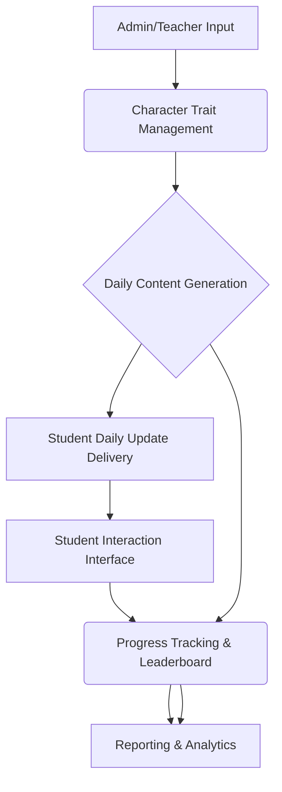

# Daily Motivational Content and Challenges System Plan

## 1. System Overview

This system aims to foster student engagement and character development by delivering daily motivational content and challenges. It will integrate with existing student data, track progress, and provide insights through a dynamic leaderboard and comprehensive reports.

**High-Level Architecture:**

## 2. Data Structures

### 2.1. Monthly Character Traits

Existing structure in `characterTraitsService.js` will be utilized and potentially extended.

*   **`CharacterTrait` Object:**
    *   `id`: Unique identifier (e.g., UUID)
    *   `name`: Name of the character trait (e.g., "Resilience", "Curiosity")
    *   `description`: Brief description of the trait
    *   `months`: Array of month numbers (1-12) to which this trait applies
    *   `quotes`: Array of pre-selected quotes related to the trait
    *   `challenges`: Array of pre-defined challenges related to the trait

### 2.2. Daily Update Content

*   **`DailyUpdate` Object:**
    *   `id`: Unique identifier
    *   `date`: Date of the daily update
    *   `characterTraitId`: Reference to the `CharacterTrait` for the month
    *   `quote`: The selected daily quote
    *   `challenge`: The selected daily challenge
    *   `studentId`: Reference to the student receiving the update (for personalized content)

### 2.3. Student Progress Tracking

*   **`StudentDailyProgress` Object:**
    *   `id`: Unique identifier
    *   `studentId`: Reference to the student
    *   `dailyUpdateId`: Reference to the `DailyUpdate`
    *   `date`: Date of the interaction
    *   `challengeCompleted`: Boolean (checkbox)
    *   `reflectionText`: Short text reflection/description from the student
    *   `pointsEarned`: Integer (based on completion, quality, consistency)
    *   `starsEarned`: Integer (derived from points)

### 2.4. Leaderboard

*   **`LeaderboardEntry` Object:**
    *   `studentId`: Reference to the student
    *   `studentName`: Student's display name
    *   `totalPoints`: Cumulative points earned
    *   `totalStars`: Cumulative stars earned
    *   `lastActivityDate`: Timestamp of last challenge completion/reflection
    *   `consistencyScore`: Metric for consistent engagement

## 3. Content Generation/Curation

The system will leverage and extend the existing `characterTraitsService.js` for quotes and challenges.

*   **Monthly Character Trait Ingestion:**
    *   Character traits will be ingested from pre-defined files or data structures (e.g., a Firestore collection, JSON files). The `getCurrentMonthTrait` function in `characterTraitsService.js` already supports fetching traits from a user's profile.
    *   An administrative interface will be needed for teachers to define and upload/manage `CharacterTrait` objects, including their associated quotes and challenges.

*   **Daily Quote and Challenge Selection:**
    *   The `getDailyQuote` and `getDailyChallenge` functions in `characterTraitsService.js` provide a mechanism for unique, student-specific selection based on `studentId` and `date`.
    *   **Source Materials/Guidelines:**
        *   **Pre-selected:** Teachers will input a pool of quotes and challenges for each character trait.
        *   **Curated/Generated:** For more dynamic content, an integration with a content generation service (e.g., a large language model API) could be explored. This would require:
            *   Clear prompts based on the `CharacterTrait.name` and `description`.
            *   Content moderation/review process to ensure appropriateness.
            *   Storage of generated content to avoid daily API calls and ensure consistency.

## 4. Daily Delivery Mechanism

*   **Automated Scheduler:** A daily scheduled job (e.g., a Firebase Cloud Function, a cron job) will trigger the content generation and delivery process.
*   **Targeted Delivery:** For each student, the system will:
    1.  Determine the current month's character trait using `getCurrentMonthTrait(userId, date)`.
    2.  Select a unique quote using `getDailyQuote(trait, studentId, date)`.
    3.  Select a unique challenge using `getDailyChallenge(trait, studentId, date)`.
    4.  Generate the daily update content (e.g., an email using `studentDailyUpdateEmail.js`).
    5.  Send the update to the student (e.g., via email, in-app notification).

## 5. Student Interaction

Students will interact with the system through a simple interface, likely within an existing student portal or via a dedicated web page linked from the daily update.

*   **Challenge Completion:** A clear checkbox or button to mark the daily challenge as complete.
*   **Reflection Input:** A short text input field for students to:
    *   Describe how they addressed the challenge.
    *   Interpret the quote and its relevance to their day or the character trait.
*   **Submission:** A submission mechanism to record `StudentDailyProgress` data.

## 6. Dynamic Leaderboard

The leaderboard will be updated in real-time based on student interactions.

*   **Star/Point System Criteria:**
    *   **Timely Completion:** Points awarded for completing the challenge on the same day it's issued.
    *   **Quality of Reflection:** Points awarded based on the length, thoughtfulness, and relevance of the reflection text. This could involve:
        *   Basic word count thresholds.
        *   Keyword analysis related to the character trait.
        *   (Advanced) Sentiment analysis or AI-driven assessment for deeper insights.
    *   **Consistency of Engagement:** Bonus points for streaks of consecutive daily completions and reflections.
    *   **Character Trait Growth:** (Future enhancement) Points for demonstrating understanding and application of the monthly character trait in reflections.

*   **Leaderboard Display:**
    *   Rankings by total points/stars.
    *   Display of student names (or anonymized IDs).
    *   Visual indicators (e.g., stars, badges) for achievements.
    *   Filtering options (e.g., by class, by month).

## 7. Comprehensive Reports

Reports will provide insights into individual and collective student growth.

*   **Individual Student Reports:**
    *   Daily challenge completion history.
    *   Timeline of reflections.
    *   Points/stars earned over time.
    *   Progress in specific character traits (e.g., "Student X showed significant improvement in 'Resilience' during October, evidenced by their reflections on overcoming difficulties in challenges.").
    *   Evidence from responses: Direct quotes from student reflections demonstrating understanding or application of character traits.

*   **Collective Student Reports (Class/School Level):**
    *   Overall challenge completion rates.
    *   Average engagement scores.
    *   Common themes or insights from reflections (e.g., "Many students focused on teamwork in their 'Collaboration' reflections this month.").
    *   Identification of character traits where students collectively excelled or struggled.
    *   Visualizations (charts, graphs) for trends over time.

*   **Reporting Focus:**
    *   Demonstrating student growth in the character trait.
    *   Providing concrete evidence from student responses to quotes and challenges.
    *   Highlighting areas for further development or intervention.

## Next Steps

The next step would be to switch to `code` mode to begin implementing the data models and core functionalities.