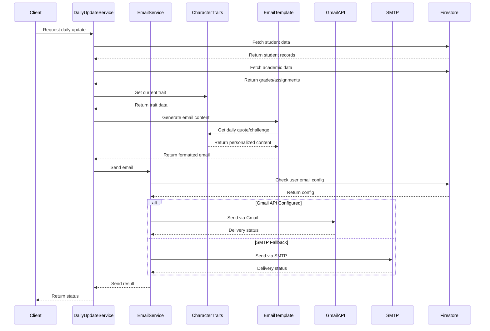

# Email System Flow and Touch Points Analysis

## System Components Interaction



## Touch Points Analysis

### 1. Data Collection Touch Points
- **Student Data**
  - Location: Firestore/students collection
  - Access: DailyUpdateService
  - Usage: Basic student info, parent contacts
  
- **Academic Data**
  - Location: Firestore/various collections
  - Access: DailyUpdateService
  - Usage: Grades, assignments, attendance

- **Character Traits**
  - Location: CharacterTraitsService
  - Access: EmailTemplate
  - Usage: Personalization content

### 2. Email Generation Touch Points
- **Template Processing**
  ```mermaid
  graph TD
    A[Raw Data] -->|Context Normalization| B[Normalized Data]
    B -->|Content Selection| C[Dynamic Content]
    C -->|HTML Generation| D[Email HTML]
    C -->|Text Generation| E[Plain Text]
    D --> F[Final Email]
    E --> F
  ```

- **Content Selection Points**
  - Greeting selection
  - Quote selection
  - Challenge selection
  - Theme selection
  - Achievement calculation

### 3. Delivery Touch Points
- **Transport Selection**
  ```mermaid
  graph TD
    A[Email Request] -->|Check Config| B{Gmail API?}
    B -->|Yes| C[Gmail API]
    B -->|No| D{SMTP Enabled?}
    D -->|Yes| E[SMTP]
    D -->|No| F[Error]
  ```

- **Error Handling Points**
  - Gmail API failures
  - SMTP failures
  - Authentication issues
  - Rate limiting

### 4. Frontend Integration Points
- **Email Preview**
  - Location: React components
  - Purpose: Preview generation
  - Data Flow: Template → Preview

- **Configuration**
  - Location: Settings components
  - Purpose: Email preferences
  - Data Flow: UI → Firestore

### 5. Monitoring Touch Points
- **Performance Metrics**
  - Template rendering time
  - Delivery success rates
  - API response times

- **Error Tracking**
  - Delivery failures
  - Template errors
  - Data fetch issues

## Critical Integration Points for New Features

### 1. Content Injection Points
- **Template Hooks**
  - Pre-greeting
  - Post-content
  - Section headers
  - Visual themes

- **Data Enhancement**
  - Student preferences
  - Historical engagement
  - Learning patterns

### 2. Safety Mechanisms
- **Content Validation**
  - HTML sanitization
  - Length constraints
  - Format verification

- **Delivery Protection**
  - Rate limiting
  - Quota management
  - Error recovery

### 3. Monitoring Integration
- **New Metrics**
  - Content variation
  - Personalization depth
  - Theme usage

- **Health Checks**
  - Content availability
  - Service status
  - Cache health

## Implementation Considerations

### 1. Non-Destructive Integration
- Maintain existing data flow
- Add parallel content paths
- Preserve fallback content
- Keep legacy support

### 2. Performance Impact
- Optimize content selection
- Implement caching
- Batch database queries
- Minimize API calls

### 3. Rollout Strategy
- Feature flags for each point
- Gradual enablement
- A/B testing capability
- Easy rollback paths

### 4. Monitoring Strategy
- Performance baselines
- Error thresholds
- Usage patterns
- Health indicators