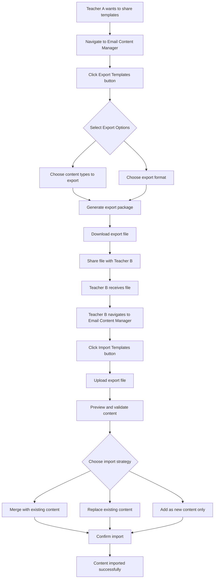

# Enhanced Export Email Content Plan for Ready Teacher

## 📋 Executive Summary

This enhanced plan provides a comprehensive strategy for implementing teacher-to-teacher email content sharing functionality in the Ready Teacher application. Based on analysis of the existing codebase, this plan addresses the complete workflow from exporting a teacher's email content library to importing and sharing it with other teachers.

## 🎯 Understanding the Current Architecture

### Data Structure Analysis

From analyzing the existing codebase, the email content system uses:

**Backend Service (`functions/src/services/emailContentService.js`):**
- Global email content library stored in `emailContent` collection
- Caching mechanism with 10-minute cache duration
- Support for 8 content types: greetings, headers (4 types), motivational quotes, visual themes, achievement badges
- Default fallback content system
**Backend Service (`functions/src/services/emailContentService.js`):**
- Global email content library stored in [`emailContent`](functions/src/services/emailContentService.js:112) collection
- Caching mechanism with 10-minute cache duration
- Support for 8 content types: [`greetings`](functions/src/services/emailContentService.js:15), [`gradeSectionHeaders`](functions/src/services/emailContentService.js:20), [`assignmentSectionHeaders`](functions/src/services/emailContentService.js:25), [`behaviorSectionHeaders`](functions/src/services/emailContentService.js:30), [`lessonSectionHeaders`](functions/src/services/emailContentService.js:35), [`motivationalQuotes`](functions/src/services/emailContentService.js:69), [`visualThemes`](functions/src/services/emailContentService.js:40), [`achievementBadges`](functions/src/services/emailContentService.js:75)
- Default fallback content system with predefined templates
- Validation system for content types and structure
- Deterministic content selection using student ID and date

**Frontend Service (`src/services/emailContentService.js`):**
- Teacher-specific document structure: [`teacher_${teacherId}`](src/services/emailContentService.js:22)
- CRUD operations: [`addTemplate()`](src/services/emailContentService.js:54), [`updateTemplate()`](src/services/emailContentService.js:88), [`deleteTemplate()`](src/services/emailContentService.js:115), [`bulkUpdate()`](src/services/emailContentService.js:141)
- Content library initialization with default empty structure

**Context and UI (`src/contexts/EmailContentContext.jsx` & `src/components/settings/EmailContentManager.jsx`):**
- React context for state management
- Tabbed UI for managing different content types
- JSON editing support for complex objects (visual themes, achievement badges)
- Bulk import functionality already exists

### Current Limitations for Export/Import

1. **No Cross-Teacher Data Access:** Current system only allows teachers to access their own content
2. **No Export Mechanism:** No existing functionality to export content libraries
3. **No Sharing Workflow:** No mechanism for teachers to share content with each other
4. **No Import Validation:** Bulk import exists but lacks comprehensive validation for external data

## 🔄 Export Requirements and User Experience Flow

### Primary User Stories

1. **As a Teacher (Exporter):** "I want to export my email content templates so I can share them with my colleague"
2. **As a Teacher (Importer):** "I want to import email templates from my colleague to enhance my own library"
3. **As a Teacher (Both):** "I want to selectively choose which content types to export/import"

### Proposed User Flow



### Export Options Design

**Content Type Selection:**
- Individual checkboxes for each content type
- "Select All" / "Deselect All" options
- Content type preview showing current template count

**Export Format Options:**
- **JSON Format:** Developer-friendly, preserves all data structure
- **Human-Readable Format:** Formatted text file for non-technical users
- **Package Format:** ZIP file containing multiple formats

**Metadata Inclusion:**
- Teacher name and school (for attribution)
- Export date and version
- Content statistics (template counts per type)
- Usage instructions

## 🎛️ Backend Export Functionality Design

### New Cloud Function: `exportEmailContent`

```javascript
// functions/src/api/exportEmailContent.js
export const exportEmailContent = onCall(async (request) => {
  const { auth, data } = request;
  const { contentTypes, format, includeMetadata } = data;
  
  // Validate authentication
  if (!auth?.uid) {
    throw new HttpsError('unauthenticated', 'User must be authenticated');
  }
  
  // Fetch teacher's content library
  const teacherId = auth.uid;
  const contentLibrary = await emailContentService.getContentLibrary(teacherId);
  
  // Filter by selected content types
  const filteredContent = filterContentByTypes(contentLibrary, contentTypes);
  
  // Generate export package
  const exportPackage = generateExportPackage(filteredContent, {
    teacherId,
    teacherName: auth.token.name || 'Unknown',
    exportDate: new Date().toISOString(),
    format,
    includeMetadata
  });
  
  // Return base64-encoded content for download
  return {
    success: true,
    data: exportPackage,
    filename: `ready-teacher-templates-${Date.now()}.json`,
    contentType: 'application/json'
  };
});
```

### Export Package Data Structure

```javascript
{
  "metadata": {
    "exportedBy": {
      "teacherId": "teacher_123",
      "teacherName": "Ms. Johnson",
      "schoolName": "Lincoln Elementary"
    },
    "exportDate": "2025-08-23T09:00:00Z",
    "version": "1.0",
    "toolVersion": "Ready Teacher v2.1",
    "contentStats": {
      "greetings": 15,
      "gradeSectionHeaders": 8,
      "motivationalQuotes": 22,
      // ... other counts
    }
  },
  "content": {
    "greetings": ["Hi {firstName}! ...", "..."],
    "gradeSectionHeaders": ["📊 Your Grades Today", "..."],
    "motivationalQuotes": ["Every expert was once...", "..."],
    "visualThemes": [
      {
        "name": "Ocean Blue",
        "primary": "#1459a9",
        "secondary": "#ed2024",
        // ... theme properties
      }
    ],
    // ... other content types
  },
  "usage": {
    "instructions": "Import these templates using the Ready Teacher Import function...",
    "compatibilityNotes": "Compatible with Ready Teacher v2.0+",
    "recommendedMergeStrategy": "merge"
  }
}
```

### Enhanced Backend Service Methods

Add to [`emailContentService.js`](src/services/emailContentService.js):

```javascript
// Export content for sharing
async exportContentLibrary(teacherId, options = {}) {
  const { contentTypes, includeMetadata = true } = options;
  
  try {
    const contentLibrary = await this.getContentLibrary(teacherId);
    
    // Filter content types if specified
    const filteredContent = contentTypes 
      ? this.filterContentTypes(contentLibrary, contentTypes)
      : contentLibrary;
    
    const exportData = {
      content: filteredContent,
      ...(includeMetadata && {
        metadata: await this.generateExportMetadata(teacherId)
      })
    };
    
    return exportData;
  } catch (error) {
    console.error('Error exporting content library:', error);
    throw error;
  }
}

// Import content from another teacher
async importContentLibrary(teacherId, importData, strategy = 'merge') {
  const { content, metadata } = importData;
  
  try {
    // Validate import data
    const validationResult = this.validateImportData(content);
    if (!validationResult.isValid) {
      throw new Error(`Invalid import data: ${validationResult.errors.join(', ')}`);
    }
    
    // Get current content library
    const currentLibrary = await this.getContentLibrary(teacherId);
    
    // Apply import strategy
    let mergedContent;
    switch (strategy) {
      case 'replace':
        mergedContent = content;
        break;
      case 'add_only':
        mergedContent = this.addOnlyMerge(currentLibrary, content);
        break;
      case 'merge':
      default:
        mergedContent = this.smartMerge(currentLibrary, content);
        break;
    }
    
    // Save merged content
    await this.replaceContentLibrary(teacherId, mergedContent);
    
    return {
      success: true,
      importedItemsCount: this.countImportedItems(content),
      strategy,
      metadata
    };
  } catch (error) {
    console.error('Error importing content library:', error);
    throw error;
  }
}
```

## 🎨 Frontend Export UI Components

### Enhanced EmailContentManager Component

Add to existing [`EmailContentManager.jsx`](src/components/settings/EmailContentManager.jsx):

```javascript
// Add import statements
import { Download, Upload, Share } from '@mui/icons-material';
import EmailContentExportDialog from './EmailContentExportDialog';
import EmailContentImportDialog from './EmailContentImportDialog';

// Add state variables
const [exportDialog, setExportDialog] = useState(false);
const [importDialog, setImportDialog] = useState(false);

// Add export/import handlers
const handleExportContent = async (exportOptions) => {
  try {
    setError(null);
    const result = await emailContentService.exportContentLibrary(
      currentUser.uid, 
      exportOptions
    );
    
    // Create and trigger download
    const blob = new Blob([JSON.stringify(result, null, 2)], {
      type: 'application/json'
    });
    const url = URL.createObjectURL(blob);
    const a = document.createElement('a');
    a.href = url;
    a.download = `ready-teacher-templates-${new Date().toISOString().split('T')[0]}.json`;
    document.body.appendChild(a);
    a.click();
    document.body.removeChild(a);
    URL.revokeObjectURL(url);
    
    setExportDialog(false);
    setSuccess('Templates exported successfully! File has been downloaded.');
    setTimeout(() => setSuccess(null), 5000);
  } catch (err) {
    console.error('Export error:', err);
    setError('Failed to export templates: ' + err.message);
  }
};

const handleImportContent = async (importData, strategy) => {
  try {
    setError(null);
    const result = await emailContentService.importContentLibrary(
      currentUser.uid, 
      importData, 
      strategy
    );
    
    // Reload content library
    await loadContentLibrary();
    
    setImportDialog(false);
    setSuccess(`Successfully imported ${result.importedItemsCount} templates!`);
    setTimeout(() => setSuccess(null), 5000);
  } catch (err) {
    console.error('Import error:', err);
    setError('Failed to import templates: ' + err.message);
  }
};

// Add buttons to the main UI (after the current buttons section)
<Box sx={{ display: 'flex', gap: 1, mt: 2 }}>
  <Button 
    variant="outlined" 
    startIcon={<Download />}
    onClick={() => setExportDialog(true)}
    color="primary"
  >
    Export Templates
  </Button>
  <Button 
    variant="outlined" 
    startIcon={<Upload />}
    onClick={() => setImportDialog(true)}
    color="secondary"
  >
    Import Templates
  </Button>
</Box>

// Add dialogs before the closing div
<EmailContentExportDialog
  open={exportDialog}
  onClose={() => setExportDialog(false)}
  contentLibrary={contentLibrary}
  onExport={handleExportContent}
/>

<EmailContentImportDialog
  open={importDialog}
  onClose={() => setImportDialog(false)}
  onImport={handleImportContent}
/>
```

## 🔄 Import Functionality Design

### Import Dialog Component

```javascript
// src/components/settings/EmailContentImportDialog.jsx
import React, { useState } from 'react';
import {
  Dialog, DialogTitle, DialogContent, DialogActions,
  Button, Typography, Box, Alert, LinearProgress,
  RadioGroup, FormControlLabel, Radio,
  Accordion, AccordionSummary, AccordionDetails,
  List, ListItem, ListItemText, Chip
} from '@mui/material';
import { ExpandMore, CloudUpload } from '@mui/icons-material';

const EmailContentImportDialog = ({ open, onClose, onImport }) => {
  const [importFile, setImportFile] = useState(null);
  const [importData, setImportData] = useState(null);
  const [importStrategy, setImportStrategy] = useState('merge');
  const [isValidating, setIsValidating] = useState(false);
  const [validationErrors, setValidationErrors] = useState([]);
  const [isImporting, setIsImporting] = useState(false);

  const handleFileSelect = async (event) => {
    const file = event.target.files[0];
    if (!file) return;

    setImportFile(file);
    setIsValidating(true);
    setValidationErrors([]);

    try {
      const text = await file.text();
      const data = JSON.parse(text);
      
      // Validate import data structure
      const errors = validateImportData(data);
      if (errors.length > 0) {
        setValidationErrors(errors);
        setImportData(null);
      } else {
        setImportData(data);
      }
    } catch (error) {
      setValidationErrors(['Invalid JSON file format']);
      setImportData(null);
    } finally {
      setIsValidating(false);
    }
  };

  const validateImportData = (data) => {
    const errors = [];
    
    if (!data.content) {
      errors.push('Missing content section in import file');
    }
    
    if (!data.metadata) {
      errors.push('Missing metadata section in import file');
    }
    
    // Validate content types
    const validContentTypes = [
      'greetings', 'gradeSectionHeaders', 'assignmentSectionHeaders',
      'behaviorSectionHeaders', 'lessonSectionHeaders', 'motivationalQuotes',
      'visualThemes', 'achievementBadges'
    ];
    
    if (data.content) {
      Object.keys(data.content).forEach(key => {
        if (!validContentTypes.includes(key)) {
          errors.push(`Unknown content type: ${key}`);
        }
      });
    }
    
    return errors;
  };

  const handleImport = async () => {
    if (!importData) return;
    
    setIsImporting(true);
    try {
      await onImport(importData, importStrategy);
    } finally {
      setIsImporting(false);
    }
  };

  const getImportPreview = () => {
    if (!importData?.content) return null;
    
    return Object.entries(importData.content).map(([type, items]) => ({
      type,
      count: Array.isArray(items) ? items.length : 0,
      items: Array.isArray(items) ? items.slice(0, 3) : []
    }));
  };

  return (
    <Dialog open={open} onClose={onClose} maxWidth="md" fullWidth>
      <DialogTitle>Import Email Content Templates</DialogTitle>
      <DialogContent>
        <Typography variant="body2" color="text.secondary" paragraph>
          Import email content templates from another teacher to enhance your library.
        </Typography>

        {/* File Upload */}
        <Box sx={{ mb: 3 }}>
          <input
            type="file"
            accept=".json"
            onChange={handleFileSelect}
            style={{ display: 'none' }}
            id="import-file-input"
          />
          <label htmlFor="import-file-input">
            <Button
              component="span"
              variant="outlined"
              startIcon={<CloudUpload />}
              fullWidth
              sx={{ mb: 2 }}
            >
              Choose Import File (.json)
            </Button>
          </label>
          {importFile && (
            <Typography variant="body2" color="text.secondary">
              Selected: {importFile.name}
            </Typography>
          )}
        </Box>

        {/* Validation Progress */}
        {isValidating && (
          <Box sx={{ mb: 2 }}>
            <Typography variant="body2" gutterBottom>Validating import file...</Typography>
            <LinearProgress />
          </Box>
        )}

        {/* Validation Errors */}
        {validationErrors.length > 0 && (
          <Alert severity="error" sx={{ mb: 2 }}>
            <Typography variant="body2" gutterBottom>Import validation failed:</Typography>
            <ul>
              {validationErrors.map((error, index) => (
                <li key={index}>{error}</li>
              ))}
            </ul>
          </Alert>
        )}

        {/* Import Preview */}
        {importData && (
          <Box sx={{ mb: 3 }}>
            <Typography variant="h6" gutterBottom>Import Preview</Typography>
            
            {/* Metadata */}
            {importData.metadata && (
              <Box sx={{ mb: 2, p: 2, bgcolor: 'grey.50', borderRadius: 1 }}>
                <Typography variant="subtitle2" gutterBottom>Source Information</Typography>
                <Typography variant="body2">
                  From: {importData.metadata.exportedBy?.teacherName || 'Unknown Teacher'}
                </Typography>
                <Typography variant="body2">
                  School: {importData.metadata.exportedBy?.schoolName || 'Unknown School'}
                </Typography>
                <Typography variant="body2">
                  Export Date: {importData.metadata.exportDate ? new Date(importData.metadata.exportDate).toLocaleDateString() : 'Unknown'}
                </Typography>
              </Box>
            )}

            {/* Content Preview */}
            <Accordion>
              <AccordionSummary expandIcon={<ExpandMore />}>
                <Typography>Content Types ({getImportPreview()?.length || 0})</Typography>
              </AccordionSummary>
              <AccordionDetails>
                <List dense>
                  {getImportPreview()?.map(({ type, count, items }) => (
                    <ListItem key={type}>
                      <ListItemText
                        primary={
                          <Box sx={{ display: 'flex', alignItems: 'center', gap: 1 }}>
                            <Typography variant="body2">{type}</Typography>
                            <Chip label={`${count} items`} size="small" />
                          </Box>
                        }
                        secondary={
                          items.length > 0 && (
                            <Typography variant="caption" color="text.secondary">
                              Preview: {items[0]?.name || items[0] || 'Complex object'}
                              {items.length > 1 && `, ${items[1]?.name || items[1] || 'Complex object'}`}
                              {count > 2 && `, +${count - 2} more...`}
                            </Typography>
                          )
                        }
                      />
                    </ListItem>
                  ))}
                </List>
              </AccordionDetails>
            </Accordion>

            {/* Import Strategy */}
            <Box sx={{ mt: 2 }}>
              <Typography variant="h6" gutterBottom>Import Strategy</Typography>
              <RadioGroup
                value={importStrategy}
                onChange={(e) => setImportStrategy(e.target.value)}
              >
                <FormControlLabel
                  value="merge"
                  control={<Radio />}
                  label={
                    <Box>
                      <Typography variant="body2">Merge with existing content</Typography>
                      <Typography variant="caption" color="text.secondary">
                        Add new templates and keep existing ones. Duplicates will be added as separate items.
                      </Typography>
                    </Box>
                  }
                />
                <FormControlLabel
                  value="add_only"
                  control={<Radio />}
                  label={
                    <Box>
                      <Typography variant="body2">Add only new content</Typography>
                      <Typography variant="caption" color="text.secondary">
                        Only add templates that don't already exist (based on exact text match).
                      </Typography>
                    </Box>
                  }
                />
                <FormControlLabel
                  value="replace"
                  control={<Radio />}
                  label={
                    <Box>
                      <Typography variant="body2" color="error.main">Replace all existing content</Typography>
                      <Typography variant="caption" color="error.main">
                        ⚠️ This will completely replace your current templates with the imported ones.
                      </Typography>
                    </Box>
                  }
                />
              </RadioGroup>
            </Box>
          </Box>
        )}
      </DialogContent>
      
      <DialogActions>
        <Button onClick={onClose}>Cancel</Button>
        <Button
          onClick={handleImport}
          variant="contained"
          disabled={!importData || isImporting}
        >
          {isImporting ? 'Importing...' : 'Import Templates'}
        </Button>
      </DialogActions>
    </Dialog>
  );
};

export default EmailContentImportDialog;
```

## 🔒 Security and Permission Requirements

### Access Control
- **User Authentication:** All export/import operations require valid Firebase Authentication
- **Data Isolation:** Teachers can only export their own content libraries
- **No Cross-User Access:** Import doesn't require access to other users' data
- **File-Based Sharing:** Uses secure file-based sharing rather than direct database access

### Data Validation
- **Structure Validation:** Comprehensive validation of import data structure
- **Content Type Validation:** Ensure only valid content types are imported
- **Size Limits:** Implement reasonable limits on import file sizes
- **Sanitization:** Sanitize imported content to prevent XSS or injection attacks

### Privacy Considerations
- **Metadata Handling:** Optional inclusion of teacher/school information
- **Content Review:** Import preview allows teachers to review content before applying
- **Selective Import:** Teachers can choose which content types to import

## 🎯 User Feedback and Error Handling

### Success Feedback
- **Export Success:** Clear confirmation with download initiated
- **Import Success:** Show number of templates imported and which strategy was used
- **Progress Indicators:** Loading states during validation and import processes

### Error Handling Scenarios

1. **Export Errors:**
   - No content to export
   - Network failures during export
   - Authentication errors

2. **Import Errors:**
   - Invalid JSON format
   - Missing required fields
   - Incompatible data structure
   - Network failures during import

3. **User Guidance:**
   - Clear error messages with actionable advice
   - Validation feedback before import
   - Recovery suggestions for common issues

## 🧪 Testing Strategy

### Unit Tests

**Backend Service Tests:**
```javascript
describe('EmailContentService Export/Import', () => {
  test('exportContentLibrary returns properly formatted export data', async () => {
    // Test export functionality
  });

  test('importContentLibrary correctly merges content with merge strategy', async () => {
    // Test merge strategy
  });

  test('importContentLibrary validates data structure', async () => {
    // Test validation
  });

  test('importContentLibrary handles invalid data gracefully', async () => {
    // Test error handling
  });
});
```

**Frontend Component Tests:**
- Export dialog interaction and file generation
- Import dialog file validation and preview
- Error handling and user feedback

### Integration Tests
- Full export-to-import workflow
- Cross-browser compatibility
- File download/upload functionality

### End-to-End Tests
1. **Teacher A exports content successfully**
2. **Teacher B imports and merges content**
3. **Content appears correctly in Teacher B's library**
4. **Email generation uses imported content**

## 📋 Implementation Roadmap

### Phase 1: Backend Foundation
- [ ] Implement export service methods
- [ ] Create import service methods with validation
- [ ] Add merge strategies (merge, add_only, replace)
- [ ] Implement data structure validation

### Phase 2: Frontend Export UI
- [ ] Create export dialog component
- [ ] Add export buttons to EmailContentManager
- [ ] Implement file download functionality
- [ ] Add export progress feedback

### Phase 3: Frontend Import UI
- [ ] Create import dialog component
- [ ] Add import buttons to EmailContentManager
- [ ] Implement file upload and validation
- [ ] Add import preview functionality

### Phase 4: Enhanced Features
- [ ] Add content type filtering for export
- [ ] Implement advanced merge strategies
- [ ] Add export/import history tracking
- [ ] Create sharing workflow documentation

### Phase 5: Testing and Optimization
- [ ] Comprehensive unit test coverage
- [ ] Integration testing
- [ ] Performance optimization
- [ ] Security audit

## 🎉 Success Metrics

### User Adoption
- Number of teachers using export functionality
- Number of successful imports per month
- User feedback scores on sharing experience

### Technical Performance
- Export/import success rates
- Average processing times
- Error rates and resolution

### Educational Impact
- Increased template diversity across teachers
- Improved email engagement metrics
- Teacher collaboration and content sharing

## 🔄 Future Enhancements

### Advanced Sharing Features
- **Online Template Library:** Central repository of shared templates
- **Template Rating System:** Community-driven template quality ratings
- **Collaborative Editing:** Real-time collaborative template creation
- **Template Categories:** Organized template browsing by subject/grade level

### Enhanced Export Options
- **Selective Content Export:** Export individual templates rather than entire categories
- **Batch Operations:** Export multiple teachers' content at once (admin feature)
- **Format Variations:** Export to PDF, Word documents, or plain text
- **Template Versioning:** Track changes and versions of shared templates

### Integration Possibilities
- **Google Drive Integration:** Direct save to Google Drive
- **Email Sharing:** Send templates directly via email
- **QR Code Sharing:** Generate QR codes for easy template sharing
- **Mobile App Support:** Export/import functionality on mobile devices

This enhanced plan provides a comprehensive roadmap for implementing robust teacher-to-teacher email content sharing while maintaining security, usability, and system integrity.