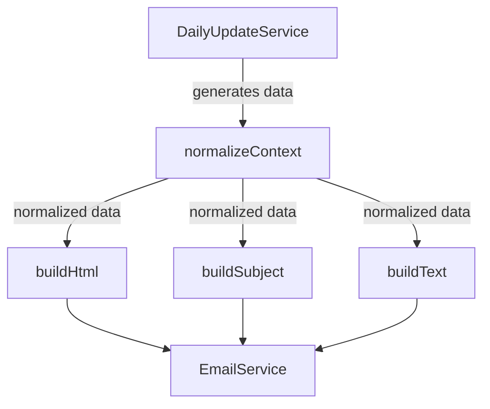

# Phase 1: Email System Analysis

## Current Email Template Structure

### Core Components

1. **Template Entry Point**: [`studentDailyUpdateEmail.js`](functions/src/templates/studentDailyUpdateEmail.js)
   - Main export: `buildStudentDailyEmailTemplate`
   - Sub-functions: `buildSubject`, `buildHtml`, `buildText`
   - Uses context normalization for backward compatibility

2. **Data Flow**

### Key Dependencies

1. **External Libraries**
   - dayjs (date handling)
   - sanitize-html (content safety)

2. **Internal Services**
   - characterTraitsService
   - emailService
   - dailyUpdateService

### Current Personalization Features

1. **Student-Specific Content**
   - Name-based greetings
   - Gender-aware pronouns
   - Grade-based encouragement
   - Attendance recognition
   - Behavior acknowledgments

2. **Dynamic Content Generation**
   - Progress meters
   - Achievement badges
   - Focus tips
   - Daily quotes
   - Challenges

3. **Visual Theming**
   - Grade-based colors
   - Section-specific styling
   - Responsive design elements

## Email Flow Analysis

### Generation Process

1. **Data Collection** (`DailyUpdateService`)
   - Aggregates student data
   - Collects attendance
   - Gathers assignments
   - Compiles grades
   - Retrieves behavior records

2. **Template Processing** (`studentDailyUpdateEmail.js`)
   - Normalizes input data
   - Generates HTML structure
   - Creates plain text alternative
   - Builds email subject

3. **Delivery** (`EmailService`)
   - Handles SMTP/Gmail API switching
   - Manages delivery quotas
   - Handles retries
   - Logs delivery status

### Touch Points

1. **Frontend Integration**
   - Email preview components
   - Configuration interfaces
   - Delivery monitoring

2. **Backend Services**
   - Firebase Functions
   - Firestore database
   - Gmail API integration
   - SMTP fallback

## Current Safety Mechanisms

1. **Content Safety**
   - HTML sanitization
   - Fallback content
   - Default values
   - Error boundaries

2. **Delivery Safety**
   - Rate limiting
   - Retry logic
   - Fallback transport
   - Error logging

3. **Data Validation**
   - Context normalization
   - Type checking
   - Null handling
   - Array safety

## Test Cases for Existing Functionality

### Template Generation Tests

1. **Context Normalization**
   - Legacy data format support
   - Missing field handling
   - Type conversion
   - Default values

2. **Content Generation**
   - HTML structure validity
   - Plain text generation
   - Subject line formatting
   - Dynamic content insertion

3. **Personalization Logic**
   - Student name handling
   - Grade-based content
   - Attendance recognition
   - Behavior acknowledgment

### Service Integration Tests

1. **Data Flow**
   - Service communication
   - Error propagation
   - Cache behavior
   - Retry mechanisms

2. **Email Delivery**
   - Transport selection
   - Quota management
   - Error handling
   - Delivery confirmation

## Areas Requiring Special Attention

1. **Legacy Support**
   - Maintain backward compatibility
   - Support legacy data formats
   - Preserve existing functionality
   - Handle deprecated features

2. **Performance Considerations**
   - Template rendering speed
   - Data aggregation efficiency
   - Caching effectiveness
   - Resource utilization

3. **Error Handling**
   - Graceful degradation
   - Fallback content
   - Error reporting
   - Recovery mechanisms

4. **Monitoring Needs**
   - Performance metrics
   - Error rates
   - Usage patterns
   - Resource consumption