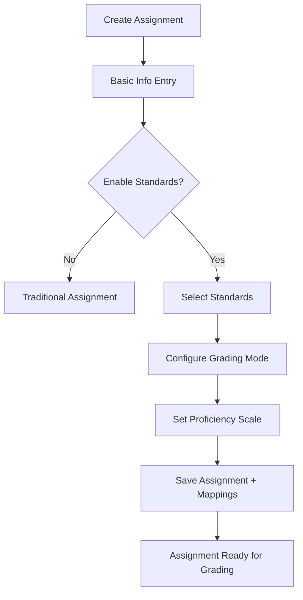
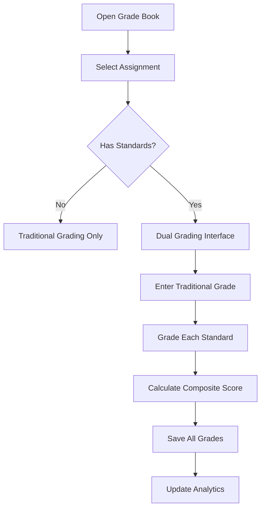
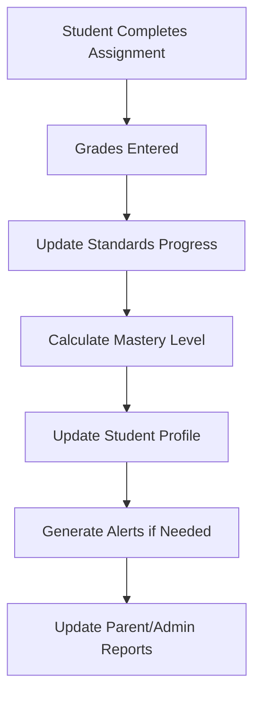

# Standards-Based Grading Integration Plan
Phase 1: Requirements Gathering and Planning

Review the existing assignment and grading system to identify key integration points.
Collaborate with stakeholders to gather requirements for the standards-based grading system.
Define the scope, timeline, and resources needed for the project.
Phase 2: Standards Management

Design and implement a standards management system to store and retrieve educational standards.
Develop a user interface for teachers to browse, search, and select standards for assignments.
Integrate the standards management system with the existing assignment management system.
Phase 3: Assignment Creation and Editing

Modify the assignment creation and editing workflow to include standards selection.
Develop a user interface for teachers to select and map standards to assignments.
Integrate the standards mapping feature with the existing assignment management system.
Phase 4: Grade Entry and Calculations

Design and implement a grade entry system for standards-based grading.
Develop a user interface for teachers to enter grades for individual standards.
Integrate the grade entry system with the existing grade management system.
Modify the grade calculation logic to accommodate standards-based grading.
Phase 5: Analytics and Reporting

Design and implement analytics and reporting features for standards-based grading.
Develop a user interface for teachers to view student progress and standards mastery.
Integrate the analytics and reporting features with the existing grade management system.
Phase 6: Testing and Deployment

Conduct unit testing, integration testing, and user acceptance testing for the standards-based grading system.
Deploy the system to production and provide training and support for teachers.
Technical Details

Frontend: React, Redux, and Material-UI for the user interface.
Backend: Node.js, Express, and Firebase Firestore for the API and data storage.
Integration: RESTful API for integrating with the existing assignment and grade management systems.
Timeline

Phase 1: 2 weeks
Phase 2: 4 weeks
Phase 3: 4 weeks
Phase 4: 6 weeks
Phase 5: 4 weeks
Phase 6: 2 weeks
## Executive Summary

This document outlines a comprehensive plan to integrate standards-based grading into the existing assignment and grading system. The integration will allow teachers to:

1. **Dual Grading System**: Grade assignments with both traditional points-based grades AND individual standards assessments
2. **Standards Selection**: Choose specific educational standards for each assignment during creation/editing
3. **Individual Standards Grading**: Grade each selected standard separately for each student
4. **Enhanced Analytics**: View progress on individual standards across assignments and time
5. **Comprehensive Reporting**: Generate reports showing both traditional grades and standards mastery

## Current System Analysis

### Existing Architecture
- **Assignment Management**: [`src/pages/Assignments.js`](src/pages/Assignments.js) with enhanced form components
- **Grade Management**: [`src/pages/GradeBook.js`](src/pages/GradeBook.js) with virtualized table
- **Standards Management**: [`src/pages/Standards.js`](src/pages/Standards.js) with browser and import/export
- **Data Layer**: Firebase Firestore with real-time updates
- **Context Management**: React contexts for assignments, grades, and students

### Key Integration Points Identified
1. **Assignment Creation/Editing**: [`src/components/assignments/EnhancedAssignmentForm.jsx`](src/components/assignments/EnhancedAssignmentForm.jsx)
2. **Standards Mapping**: [`src/components/standards/StandardsMapper.jsx`](src/components/standards/StandardsMapper.jsx) 
3. **Grade Entry**: [`src/pages/GradeBook.js`](src/pages/GradeBook.js) and [`src/components/grades/VirtualizedGradeTable.jsx`](src/components/grades/VirtualizedGradeTable.jsx)
4. **Grade Calculations**: [`src/utils/gradeCalculations.js`](src/utils/gradeCalculations.js)
5. **Data Services**: [`src/services/standardsService.js`](src/services/standardsService.js) and [`src/services/apiService.js`](src/services/apiService.js)

## Database Schema Design

### New Collections/Documents

#### 1. Assignment-Standards Mappings
```javascript
// Collection: assignment_standards_mappings
{
  id: "mapping_id",
  assignmentId: "assignment_id",
  standardId: "standard_id", 
  userId: "user_id",
  alignmentStrength: 0.75, // 0.25, 0.5, 0.75, 1.0
  coverageType: "full", // "full", "partial", "supporting"
  weight: 1.0, // Weight of this standard in the assignment
  createdAt: timestamp,
  updatedAt: timestamp
}
```

#### 2. Standards-Based Grades
```javascript
// Collection: standards_grades
{
  id: "standards_grade_id",
  studentId: "student_id",
  assignmentId: "assignment_id", 
  standardId: "standard_id",
  userId: "user_id",
  
  // Grading Information
  proficiencyLevel: 4, // 1-4 scale (Beginning, Developing, Proficient, Advanced)
  score: 85, // Optional numeric score
  notes: "Student demonstrates strong understanding...",
  
  // Metadata
  gradedBy: "teacher_id",
  gradedAt: timestamp,
  subject: "Mathematics",
  
  // Tracking
  createdAt: timestamp,
  updatedAt: timestamp,
  
  // Relationships
  traditionalGradeId: "traditional_grade_id" // Link to existing grade
}
```

#### 3. Enhanced Traditional Grades
```javascript
// Existing grades collection - ADD these fields:
{
  // ... existing fields ...
  
  // Standards Integration
  hasStandardsGrading: true,
  standardsGradesCount: 3,
  averageStandardsProficiency: 3.2,
  
  // Composite Scoring
  traditionalScore: 85, // Original points-based score
  standardsScore: 3.2, // Average standards proficiency
  compositeScore: 87, // Weighted combination if desired
}
```

### Modified Collections

#### 1. Enhanced Assignments
```javascript
// Add to existing assignments:
{
  // ... existing fields ...
  
  // Standards Integration
  hasStandardsAssessment: true,
  mappedStandardsCount: 3,
  standardsWeight: 0.5, // Weight of standards vs traditional grading
  
  // Grading Configuration
  gradingMode: "dual", // "traditional", "standards", "dual"
  proficiencyScale: "four_point", // "four_point", "five_point", "custom"
  
  // Standards Metadata
  mappedStandards: ["CCSS.MATH.5.NBT.1", "CCSS.MATH.5.NBT.2"], // Quick reference
}
```

## API Service Extensions

### New Service Functions

#### 1. Standards Mapping Service
```javascript
// src/services/standardsService.js - ADD these functions:

// Get mappings for an assignment
export const getStandardsMappings = async (assignmentId) => {
  // Query assignment_standards_mappings by assignmentId
}

// Create new mapping
export const createStandardMapping = async (mappingData) => {
  // Create new assignment-standard mapping
}

// Delete mapping
export const deleteStandardMapping = async (mappingId) => {
  // Remove assignment-standard mapping
}

// Get all mappings for a user
export const getUserStandardsMappings = async () => {
  // Get all mappings for current user
}
```

#### 2. Standards Grading Service
```javascript
// src/services/standardsGradingService.js - NEW FILE

// Create standards grade
export const createStandardsGrade = async (standardsGradeData) => {
  // Create new standards-based grade entry
}

// Update standards grade
export const updateStandardsGrade = async (gradeId, updates) => {
  // Update existing standards grade
}

// Get standards grades for assignment
export const getStandardsGradesByAssignment = async (assignmentId) => {
  // Get all standards grades for an assignment
}

// Get standards grades for student
export const getStandardsGradesByStudent = async (studentId, standardId = null) => {
  // Get student's standards grades, optionally filtered by standard
}

// Delete standards grades
export const deleteStandardsGrade = async (gradeId) => {
  // Delete standards grade entry
}

// Bulk operations
export const bulkCreateStandardsGrades = async (gradesArray) => {
  // Create multiple standards grades at once
}
```

#### 3. Enhanced Grade Calculations
```javascript
// src/utils/standardsGradeCalculations.js - NEW FILE

// Calculate standards proficiency average
export const calculateStandardsProficiency = (standardsGrades) => {
  // Calculate average proficiency across standards
}

// Calculate composite grade
export const calculateCompositeGrade = (traditionalGrade, standardsGrades, weights) => {
  // Combine traditional and standards grades
}

// Generate standards progress report
export const generateStandardsProgress = (studentId, standardId, timeRange) => {
  // Track student progress on specific standard over time
}

// Calculate standards mastery level
export const calculateMasteryLevel = (standardsGrades, masteryThreshold = 3.0) => {
  // Determine if student has mastered a standard
}
```

## UI Component Design

### 1. Enhanced Assignment Form Integration

#### Modifications to [`EnhancedAssignmentForm.jsx`](src/components/assignments/EnhancedAssignmentForm.jsx)

```javascript
// ADD new state and form fields:
const [standardsGradingEnabled, setStandardsGradingEnabled] = useState(false);
const [selectedStandards, setSelectedStandards] = useState([]);
const [gradingMode, setGradingMode] = useState('dual'); // traditional, standards, dual
const [proficiencyScale, setProficiencyScale] = useState('four_point');

// ADD new form section:
<Grid item xs={12}>
  <Accordion>
    <AccordionSummary expandIcon={<ExpandMoreIcon />}>
      <Typography variant="h6">Standards-Based Assessment</Typography>
    </AccordionSummary>
    <AccordionDetails>
      <FormControlLabel
        control={
          <Switch
            checked={standardsGradingEnabled}
            onChange={(e) => setStandardsGradingEnabled(e.target.checked)}
          />
        }
        label="Enable Standards-Based Grading"
      />
      
      {standardsGradingEnabled && (
        <Box sx={{ mt: 2 }}>
          <StandardsSelector
            subject={formData.subject}
            selectedStandards={selectedStandards}
            onStandardsChange={setSelectedStandards}
          />
          
          <FormControl fullWidth sx={{ mt: 2 }}>
            <InputLabel>Grading Mode</InputLabel>
            <Select
              value={gradingMode}
              onChange={(e) => setGradingMode(e.target.value)}
              label="Grading Mode"
            >
              <MenuItem value="traditional">Traditional Only</MenuItem>
              <MenuItem value="standards">Standards Only</MenuItem>
              <MenuItem value="dual">Dual Grading</MenuItem>
            </Select>
          </FormControl>
        </Box>
      )}
    </AccordionDetails>
  </Accordion>
</Grid>
```

### 2. New Standards Selector Component

#### Create [`src/components/standards/StandardsSelector.jsx`](src/components/standards/StandardsSelector.jsx)

```javascript
// Multi-select component for choosing standards during assignment creation
const StandardsSelector = ({ 
  subject, 
  selectedStandards, 
  onStandardsChange,
  maxSelections = 5 
}) => {
  // Features:
  // - Search/filter standards by subject
  // - Multi-select with chips display
  // - Alignment strength setting per standard
  // - Coverage type selection
  // - Preview of selected standards
}
```

### 3. Enhanced Grade Entry Interface

#### Modifications to [`VirtualizedGradeTable.jsx`](src/components/grades/VirtualizedGradeTable.jsx)

```javascript
// ADD standards grading columns when assignment has standards
const renderStandardsGradingCell = (student, assignment, standard) => {
  return (
    <StandardsGradeCell
      studentId={student.id}
      assignmentId={assignment.id}
      standardId={standard.id}
      currentGrade={getStandardsGrade(student.id, assignment.id, standard.id)}
      onGradeChange={handleStandardsGradeChange}
      proficiencyScale={assignment.proficiencyScale}
    />
  );
};

// Enhanced column structure:
// [Student Name] | [Assignment 1 Traditional] | [Std 1] | [Std 2] | [Assignment 2 Traditional] | [Std 3] | ...
```

### 4. New Standards Grade Cell Component

#### Create [`src/components/grades/StandardsGradeCell.jsx`](src/components/grades/StandardsGradeCell.jsx)

```javascript
const StandardsGradeCell = ({
  studentId,
  assignmentId, 
  standardId,
  currentGrade,
  onGradeChange,
  proficiencyScale = 'four_point'
}) => {
  // Features:
  // - Dropdown for proficiency levels (1-4 or 1-5)
  // - Color coding for proficiency levels
  // - Quick notes/comments
  // - Visual indicators for mastery
  // - Hover tooltips with standard description
}
```

### 5. Standards Progress Dashboard

#### Create [`src/components/standards/StandardsProgressDashboard.jsx`](src/components/standards/StandardsProgressDashboard.jsx)

```javascript
const StandardsProgressDashboard = ({ 
  studentId = null, // null for class view
  subject,
  timeRange = 'semester'
}) => {
  // Features:
  // - Standards mastery heatmap
  // - Progress over time charts
  // - Individual student or class view
  // - Filterable by subject/standard
  // - Export capabilities
}
```

## Grade Calculation System Modifications

### Enhanced Grade Calculator

#### Extend [`src/utils/gradeCalculations.js`](src/utils/gradeCalculations.js)

```javascript
// ADD to GradeCalculator class:

// Calculate composite grade combining traditional and standards
calculateCompositeGrade(traditionalGrade, standardsGrades, weights = { traditional: 0.5, standards: 0.5 }) {
  const traditionalPercent = (traditionalGrade.score / traditionalGrade.points) * 100;
  const standardsAverage = this.calculateStandardsAverage(standardsGrades);
  const standardsPercent = (standardsAverage / 4) * 100; // Convert 4-point to percentage
  
  return (traditionalPercent * weights.traditional) + (standardsPercent * weights.standards);
}

// Calculate standards proficiency average
calculateStandardsAverage(standardsGrades) {
  if (!standardsGrades || standardsGrades.length === 0) return 0;
  const total = standardsGrades.reduce((sum, grade) => sum + grade.proficiencyLevel, 0);
  return total / standardsGrades.length;
}

// Determine mastery status
getMasteryStatus(proficiencyLevel, threshold = 3.0) {
  if (proficiencyLevel >= threshold) return 'Mastered';
  if (proficiencyLevel >= threshold - 0.5) return 'Approaching';
  return 'Developing';
}

// Generate standards report data
generateStandardsReport(studentId, standardId, assignments) {
  // Track progress on specific standard across multiple assignments
  // Return trend data, current level, recommendations
}
```

## Workflow Integration Design

### 1. Assignment Creation Workflow



### 2. Grading Workflow



### 3. Standards Progress Tracking



## Implementation Timeline

### Phase 1: Foundation (Weeks 1-2)
- [ ] **Week 1**: Database schema implementation
  - Create new Firestore collections
  - Add indexes for performance
  - Implement basic CRUD operations
- [ ] **Week 2**: Core API services
  - Standards mapping service functions
  - Standards grading service functions
  - Enhanced grade calculations

### Phase 2: UI Components (Weeks 3-4)
- [ ] **Week 3**: Assignment form enhancements
  - Standards selector component
  - Assignment form integration
  - Standards mapping interface
- [ ] **Week 4**: Grade entry interface
  - Standards grade cell component
  - Enhanced grade table
  - Dual grading workflow

### Phase 3: Analytics & Reporting (Weeks 5-6)
- [ ] **Week 5**: Progress tracking
  - Standards progress dashboard
  - Mastery calculations
  - Trend analysis
- [ ] **Week 6**: Enhanced reporting
  - Standards-based reports
  - Parent communication features
  - Export capabilities

### Phase 4: Integration & Testing (Weeks 7-8)
- [ ] **Week 7**: Full system integration
  - End-to-end workflow testing
  - Performance optimization
  - Bug fixes and refinements
- [ ] **Week 8**: User acceptance testing
  - Teacher training materials
  - Documentation completion
  - Production deployment

## Technical Implementation Details

### 1. Data Flow Architecture

```javascript
// Assignment Creation Flow
Assignment Form → Standards Selection → Mapping Creation → Assignment Save

// Grading Flow  
Grade Entry → Traditional Grade Save → Standards Grades Save → Composite Calculation

// Reporting Flow
Data Aggregation → Standards Analysis → Report Generation → Export/Display
```

### 2. State Management Strategy

```javascript
// New Context: StandardsGradingContext
const StandardsGradingContext = createContext();

export const StandardsGradingProvider = ({ children }) => {
  const [standardsMappings, setStandardsMappings] = useState({});
  const [standardsGrades, setStandardsGrades] = useState([]);
  const [gradingMode, setGradingMode] = useState('dual');
  
  // Methods for managing standards grading state
  const addStandardsGrade = async (gradeData) => { /* ... */ };
  const updateStandardsGrade = async (gradeId, updates) => { /* ... */ };
  const getStudentStandardsProgress = (studentId, standardId) => { /* ... */ };
  
  return (
    <StandardsGradingContext.Provider value={{
      standardsMappings,
      standardsGrades,
      gradingMode,
      addStandardsGrade,
      updateStandardsGrade,
      getStudentStandardsProgress
    }}>
      {children}
    </StandardsGradingContext.Provider>
  );
};
```

### 3. Performance Considerations

#### Database Optimization
- **Compound Indexes**: Create indexes on frequently queried field combinations
  - `(userId, assignmentId, standardId)` for standards grades
  - `(userId, studentId, standardId)` for student progress queries
  - `(userId, assignmentId)` for assignment mappings

#### Caching Strategy
- **Standards Mappings**: Cache assignment-standard mappings in memory
- **Student Progress**: Cache calculated progress data with TTL
- **Grade Calculations**: Memoize expensive calculations

#### Real-time Updates
- **Firestore Listeners**: Use onSnapshot for real-time grade updates
- **Optimistic Updates**: Update UI immediately, sync with server
- **Conflict Resolution**: Handle concurrent grade updates gracefully

### 4. Error Handling & Validation

```javascript
// Grade Validation
const validateStandardsGrade = (gradeData) => {
  const errors = [];
  
  if (!gradeData.proficiencyLevel || gradeData.proficiencyLevel < 1 || gradeData.proficiencyLevel > 4) {
    errors.push('Proficiency level must be between 1 and 4');
  }
  
  if (!gradeData.studentId || !gradeData.assignmentId || !gradeData.standardId) {
    errors.push('Student, assignment, and standard IDs are required');
  }
  
  return { isValid: errors.length === 0, errors };
};

// Mapping Validation
const validateStandardMapping = (mappingData) => {
  const errors = [];
  
  if (!mappingData.alignmentStrength || mappingData.alignmentStrength < 0.25 || mappingData.alignmentStrength > 1.0) {
    errors.push('Alignment strength must be between 0.25 and 1.0');
  }
  
  if (!['full', 'partial', 'supporting'].includes(mappingData.coverageType)) {
    errors.push('Coverage type must be full, partial, or supporting');
  }
  
  return { isValid: errors.length === 0, errors };
};
```

## Migration Strategy

### 1. Existing Data Compatibility
- **Backward Compatibility**: All existing assignments and grades continue to work
- **Gradual Migration**: Teachers can opt-in to standards grading per assignment
- **Data Integrity**: No changes to existing grade calculations unless explicitly enabled

### 2. Migration Steps
1. **Deploy Database Schema**: Add new collections without affecting existing data
2. **Deploy API Services**: Add new endpoints while maintaining existing ones
3. **Deploy UI Components**: Add new features as optional enhancements
4. **Teacher Training**: Provide training on new standards grading features
5. **Gradual Adoption**: Teachers enable standards grading on new assignments

### 3. Rollback Plan
- **Feature Flags**: Use feature flags to enable/disable standards grading
- **Data Preservation**: Keep traditional grading as primary system
- **Quick Disable**: Ability to quickly disable standards features if issues arise

## Testing Strategy

### 1. Unit Testing
- **Service Functions**: Test all CRUD operations for standards grading
- **Calculations**: Test grade calculations and proficiency averaging
- **Validation**: Test input validation and error handling
- **Components**: Test UI component behavior and state management

### 2. Integration Testing
- **End-to-End Workflows**: Test complete assignment creation to grading workflow
- **Data Consistency**: Verify data integrity across traditional and standards grading
- **Real-time Updates**: Test Firestore listeners and state synchronization
- **Performance**: Load testing with large datasets

### 3. User Acceptance Testing
- **Teacher Workflows**: Test with actual teachers using realistic scenarios
- **Student Data**: Test with real student data (anonymized)
- **Edge Cases**: Test unusual grading scenarios and error conditions
- **Accessibility**: Ensure new features meet accessibility standards

## Security & Privacy Considerations

### 1. Data Protection
- **Student Privacy**: Ensure standards grades are protected same as traditional grades
- **Access Control**: Maintain existing user isolation and permissions
- **Audit Trail**: Log all grade changes for accountability
- **Data Encryption**: Encrypt sensitive grading data in transit and at rest

### 2. User Permissions
- **Teacher Access**: Only teachers can grade their own students
- **Admin Access**: Admins can view but not modify grades
- **Student Access**: Students can view their own standards progress (if enabled)
- **Parent Access**: Parents can view their child's standards progress (if enabled)

## Success Metrics

### 1. Adoption Metrics
- **Feature Usage**: Percentage of teachers using standards grading
- **Assignment Coverage**: Percentage of assignments with standards mapping
- **Grading Frequency**: How often standards grades are entered vs traditional

### 2. Performance Metrics
- **Load Times**: Page load times for enhanced grade book
- **Response Times**: API response times for grade operations
- **Error Rates**: Error rates for new grading operations
- **User Satisfaction**: Teacher feedback on new features

### 3. Educational Impact
- **Standards Coverage**: How many standards are being assessed
- **Student Progress**: Improvement in standards mastery over time
- **Teacher Insights**: Quality of feedback from standards-based data
- **Parent Engagement**: Increased parent understanding of student progress

## Risk Assessment & Mitigation

### 1. Technical Risks
- **Performance Impact**: Large datasets may slow down grade book
  - *Mitigation*: Implement pagination, caching, and database optimization
- **Data Complexity**: Dual grading system increases data complexity
  - *Mitigation*: Comprehensive testing and clear data models
- **Integration Issues**: New features may conflict with existing functionality
  - *Mitigation*: Feature flags and gradual rollout

### 2. User Adoption Risks
- **Learning Curve**: Teachers may find new system complex
  - *Mitigation*: Comprehensive training and gradual feature introduction
- **Resistance to Change**: Teachers may prefer traditional grading
  - *Mitigation*: Make standards grading optional and demonstrate benefits
- **Time Investment**: Additional grading time may discourage use
  - *Mitigation*: Streamlined UI and bulk grading features

### 3. Educational Risks
- **Grading Inconsistency**: Different teachers may grade standards differently
  - *Mitigation*: Provide clear rubrics and calibration training
- **Over-complexity**: Too many standards may overwhelm students/parents
  - *Mitigation*: Limit standards per assignment and provide clear explanations
- **Misalignment**: Standards may not align well with assignments
  - *Mitigation*: Provide guidance on standards selection and alignment

## Future Enhancements

### 1. Advanced Analytics
- **Predictive Modeling**: Predict student performance on upcoming standards
- **Intervention Alerts**: Automatic alerts when students struggle with standards
- **Comparative Analysis**: Compare student progress across different standards
- **Longitudinal Tracking**: Track standards mastery across multiple years

### 2. Enhanced Reporting
- **Standards Transcripts**: Official transcripts showing standards mastery
- **Portfolio Integration**: Link standards progress to student portfolios
- **Parent Dashboards**: Dedicated parent view of standards progress
- **Administrative Reports**: District-level standards achievement reports

### 3. AI-Powered Features
- **Auto-Mapping**: AI suggestions for assignment-standard mappings
- **Grading Assistance**: AI-powered grading suggestions based on rubrics
- **Progress Predictions**: Machine learning models for student progress
- **Personalized Learning**: Adaptive learning paths based on standards mastery

## Conclusion

This comprehensive plan provides a roadmap for integrating standards-based grading into the existing teacher kit application. The phased approach ensures minimal disruption to current workflows while providing powerful new capabilities for standards-based assessment.

The dual grading system allows teachers to maintain traditional point-based grading while adding detailed standards assessment, providing richer data for student progress tracking and instructional decision-making.

Key success factors include:
- **Gradual Implementation**: Phased rollout minimizes risk and allows for feedback
- **Teacher Choice**: Optional adoption reduces resistance and allows natural growth
- **Data Integrity**: Maintaining existing functionality ensures system reliability
- **Comprehensive Training**: Proper training ensures successful adoption and effective use

The implementation timeline of 8 weeks provides a realistic schedule for development, testing, and deployment while allowing for proper quality assurance and user training.